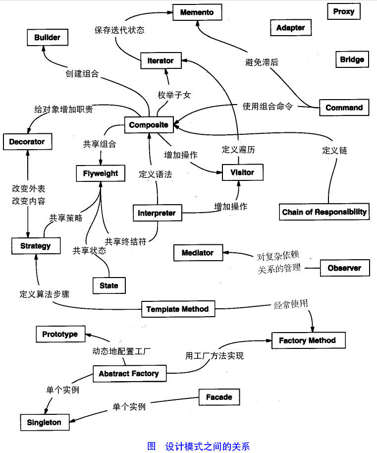

&emsp;&emsp;一直想写介绍设计模式的文章，让读者可以很快看完，而且一看就懂，看懂就会用，同时不会将各个模式搞混。当然这个需要有一定的编程经验才能做到。自己虽然不够nb，但也积累了一些经验，是时候写点东西了，也算是自我的总结。所以文中可能也存在一些纰漏，欢迎大家留言指正。

&emsp;&emsp;设计模式（Design pattern）是一套应该被反复使用的代码设计经验的总结。使用设计模式是为了可复用代码、让代码更易理解、保证代码的可靠性。

&emsp;&emsp;我知道大家（包括我在内）在写代码的时候可能不会那么刻意的去使用一些设计模式，但是它绝对是值得你去思考并使用的一套理论。项目中合理的运用设计模式可以完美的解决很多问题，并使你走向优秀代码的道路。

&emsp;&emsp;我接下来的几篇文章会以理论与实践相结合的方式来进行总结，希望广大程序爱好者和我一起，学好设计模式，做一个优秀的软件工程师！

## 设计模式六大原则
学习设计模式之前最好先了解一下设计模式的设计原则：
1. 开闭原则（open close principle）
  开放即指对扩展开放，对修改关闭。简而言之，就是扩展功能的时候应该尽量的不修改原有的代码。
2. 里氏代换原则（liskov substitution principle）
  可以理解为派生类与基类的替换关系，是对"开-闭"原则的补充。通俗来讲就是：子类可以扩展父类的功能，但不能改变父类原有的功能。也就是说：子类继承父类时，除添加新的方法完成新增功能外，尽量不要重写父类的方法。
3. 依赖倒转原则（dependence inverse principle）
  这个原则是开闭原则的基础，具体内容：针对接口编程，依赖于抽象而不依赖于具体。目的是通过要面向接口的编程来降低类间的耦合性。符合高内聚低耦合原则。
4. 接口隔离原则（Interface Segregation Principle）
  使用多个隔离的接口，比使用单个接口要好，核心就是控制类的粒度大小、将对象解耦、提高其内聚性。
5. 迪米特法则，又称最少知道原则（Demeter Principle）
  一个实体应当尽量少地与其他实体之间发生相互作用，使得系统功能模块相对独立。降低类之间的耦合度，提高了模块的相对独立性。
6. 合成复用原则（Composite Reuse Principle）
  尽量使用合成/聚合的方式，而不是使用继承。

## 设计模式类型
&emsp;&emsp;根据设计模式的参考书[Design Patterns - Elements of Reusable Object-Oriented Software](DesignPatterns.pdf)（中文译名：设计模式 - 可复用的面向对象软件元素，由GOF四人帮合著） 中所提到的，总共有 23 种设计模式。这些模式可以分为三大类：创建型模式（Creational Patterns）、结构型模式（Structural Patterns）、行为型模式（Behavioral Patterns）。
### 创建型模式
隐藏创建对象的创建逻辑，提供创建对象的接口，而非使用new关键字进行创建。
* [单例模式（Singleton Pattern）](http://localhost:4000/2019/10/17/Java设计模式-单例模式/)
* 工厂模式（Factory Pattern）
* 抽象工厂模式（Abstract Factory Pattern）
* 建造者模式（Builder Pattern）
* 原型模式（Prototype Pattern）

### 结构型模式
这些设计模式关注类和对象的组合。继承的概念被用来组合接口和定义组合对象获得新功能的方式。
* 适配器模式（Adapter Pattern）
* 桥接模式（Bridge Pattern）
* 过滤器模式（Filter、Criteria Pattern）
* 组合模式（Composite Pattern）
* 装饰器模式（Decorator Pattern）
* 外观模式（Facade Pattern）
* 享元模式（Flyweight Pattern）
* 代理模式（Proxy Pattern）

### 行为型模式
这些设计模式特别关注对象之间的通信。
* 责任链模式（Chain of Responsibility Pattern）
* 命令模式（Command Pattern）
* 解释器模式（Interpreter Pattern）
* 迭代器模式（Iterator Pattern）
* 中介者模式（Mediator Pattern）
* 备忘录模式（Memento Pattern）
* 观察者模式（Observer Pattern）
* 状态模式（State Pattern）
* 空对象模式（Null Object Pattern）
* 策略模式（Strategy Pattern）
* 模板模式（Template Pattern）
* 访问者模式（Visitor Pattern）

设计模式之间的关系可以用下图整体描述：

&emsp;&emsp;该文主要介绍一些基本概念和理论知识，后续文章会结合代码的形式详细介绍每种设计模式使用方式，如果你着急关注实际的使用，也可以跳转某一种设计模式单独了解，不必要按顺序阅读。
